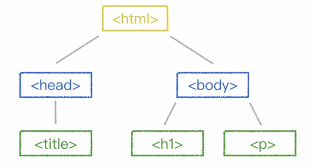
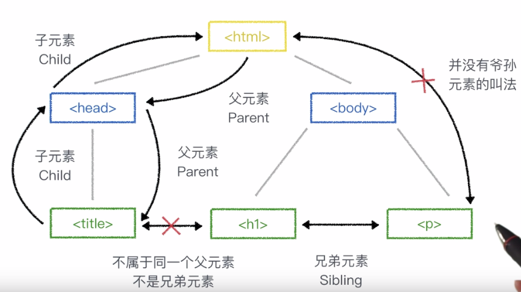

# html 和 编辑器
## 无直播课只有任务和练习

1.认识html  
浏览器对代码进行渲染将网页呈现  

一些网页源码首页比较乱的原因  
进行了代码优化、压缩了没用的代码(空格 换行等) 使得文件传输速度提高使得浏览器可以更快的打开网页  

2.html基础结构  
`<!DOCTYPE html>` 为文档声明 告诉浏览器使用哪个html版本进行解析 本行代码表示使用html5版本进行解析  

`<html>` 顶级元素或根元素 所用元素直接或间接包含在这里 html只能直接包含`<head>`和`<body>`元素 其它所有元素要么包含在`<head>`里 要么包含在`<body>`里面  

`<head>`元素内用于包含页面的通用信息(元数据)  

`<title>`写在`<head>`元素内 显示在浏览器的该页面的标签内  

`<body>`元素 用于存放页面的内容 显示在浏览器的页面区域  

3.练习 创建元素  

	<!DOCTYPE html>
	<html>
	<head>
    	<title>断章</title>
	</head>
	<body>
    	<h1>断章</h1>
    	
你站在桥上看风景，  
    	看风景的人在楼上看你。

    	
明月装饰了你的窗子， 
    	你装饰了别人的梦。

	</body>
	</html>

4.嵌套元素  
一个元素包含另一个元素(另一些元素)成为嵌套元素  
不管多么复杂的页面都是通过嵌套堆叠而成的  

5.html树  

  
注意：  
兄弟元素的父元素必须相同  

6.练习 创建图片  

	<!DOCTYPE html>
	<html>
	<head>
	<meta charset="UTF-8">
	<title>创建图片链接</title>
	</head>
	<body>
    	
	</body>
	</html>

网页中的图片可以通过：1.img标签 2.css背景图片来设置  

``是单标签元素  

img标签的属性：  
src:必备属性，表示图片地址  
alt:必备属性，如果图片加载失败将会显示该内容  
width:可选属性，用于设置图片的宽度，如width="400"(可通过css设置图片的宽高)  
height:可选属性，跟width类似，用于设置图片的高度，如height="300"(css可设置)  

target="_blank" 用来设置在一个新的窗口打开一个链接

干货：  
[HTML基础元素简介](http://www.w3school.com.cn/html/html_elements.asp)  
[Come on Baby! 你也可以成为Web开发工程师！——Web开发工程师完全成长指南](https://zhuanlan.zhihu.com/p/22978846)

