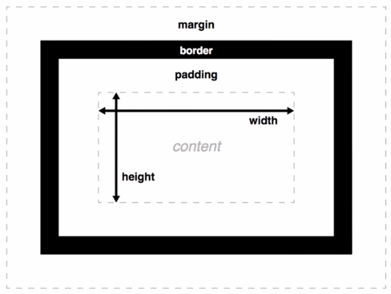

# CSS基础
## 无直播课 任务与练习

1.认识css  
css:层叠样式表 用于“装饰”页面  

2.css语法  
选择器{属性:值;属性:值;...} 一个 属性:值 称为一个声明  
由选择器选中html元素,然后由声明语句改变元素的样式  

如

	h1{
		color:red;
		font-size:20px;
	}

3.基本选择器  
元素选择器  
ID选择器(有缺陷 不常用)   
类选择器(class选择器)  
通配符选择器(* 将匹配所有元素 如*{...})  

4.练习 使用颜色  
代码不贴了  

三种颜色的表示方式  
* 颜色的英文名            color:red;  
* #+颜色的十六进制表示     color:#188eee;  
* rgb(颜色的十进制表示)    color:rgb(232,83,8);

5.盒模型  

行内盒子(行内元素)：无上下外边距 内容区域(content)宽度高度自动(取决于标签内的东西)  
例如：

	span{
		width:200px;
		height:200px;
		padding:10px;
		border:5px solid red;
		margin:10px;
	}

结果：虽然都设置了 但是无上下外边距 内容区域靠里面的内容撑起  

6.练习 设置导航样式  

	<!DOCTYPE html>
	<html>
	<head>
	    <meta charset="UTF-8">
	    <title>设置简易导航</title>
	    
	</head>
	<body>
	    <nav class="link-list">
	        <a class="link-item" href="#">首页</a>
	        <a class="link-item" href="#">技术</a>
	        <a class="link-item" href="#">杂谈</a>
	        <a class="link-item" href="#">关于</a>
	    </nav>
	</body>
	</html>

以上方法是通过a标签设置导航的方式(get到了 我以前都是通过li浮动)  

nav为html5语义化新元素 表示导航  

`text-decoration:none;`设置链接(a标签)无下划线  

boder宽度为零或不设置时 也可以应用border-radius属性  

将a(行内元素)设置`display：inline-block;`属性后，可以设置内容区域的宽高和上下外边距 也会在一行行内显示(不会独占一行)  

`display:inline-block;`详解见干货部分(本文文末)

7.元素浮动-float  
建议多看看视频  

`float:none|left|right;`  
可用于实现文字环绕图片的效果(如图)  
  
图中上边的图片是左浮动 下边的图片是右浮动  
图中的html结构为 img p p img  
本例中浮动是给img标签加浮动属性(float)  

浮动会影响父元素高度塌陷(高度为不浮动元素的高度?)

清除浮动的方法:  
在设置浮动的同级目录下设置一个元素 clear:both;  
有很多种清除浮动的方法 见干货部分(本文文末)  

8.float布局  
主流的布局方式 建议重温视频  

使用伪元素清除浮动:  
在具有浮动属性的元素的父元素上应用 ::after{content:'';display:table;clear:both;}  

aside main 为html5语义化新元素  表示侧边栏和主要的内容区域  

流体布局

	<!DOCTYPE html>
	<html lang="en">
	<head>
    <meta charset="UTF-8">
    <title>Document</title>
    
	</head>
	<body>
    

        <main class="t_main">
			
在浏览器中，空白符是不会被浏览器忽略的，多个连续的空白符浏览器会自动将其合并成一个。我们编写代码时写的空格，换行都会产生空白符。所以自然而然的两个元素之间会有空白符，如果将上述例子中的a标签写成一行，空白符消失，菜单之间也就紧凑起来了。空白符虽然是浏览器正常的表现行为，但是通常情况下，设计师同学的设计稿不会出现这些空隙，我们在还原设计稿的时候，怎么去除掉这些空隙呢。
            要去除空白符产生的间隙，首先要理解空白符归根结底是个字符，通过设置font-size属性可以控制产生的间隙的大小。
			

		</main>
        <aside class="t_left">观察上面的例子，细心的同学肯定会发现，每个li之间有一个小空隙，而我们的代码中并没有设置margin等相关属性，这是为什么呢？
		</aside>
        <aside class="t_right">默认情况下，inline元素之间就有空隙出现，所以结合了inline和block属性的inline-block属性自然也有这个特点。
            空隙是空白符！
		</aside>
    

	</body>
	</html>

9.元素位置 position  
`position:static(默认)|relative|absolute|fixed;`  

relative:相对于自己的位置偏移  
  

absolute:相对于非static最近的父级元素  
  

fixed：  相对于视窗(视窗：浏览器窗口)  
  

干货  
[详解CSS display:inline-block的应用](http://web.jobbole.com/84089/)  
[W3C css教程](http://www.w3school.com.cn/css/index.asp)  
[CSS z-index 属性](http://www.w3school.com.cn/cssref/pr_pos_z-index.asp)  
[视频 简历 响应 bootstrap](https://ke.qq.com/webcourse/index.html#course_id=192657&term_id=100228265&taid=1148547269587089&vid=w1417nevzms)   

[MDN 布局](https://developer.mozilla.org/zh-CN/docs/Web/Guide/CSS/Getting_started/Layout)
