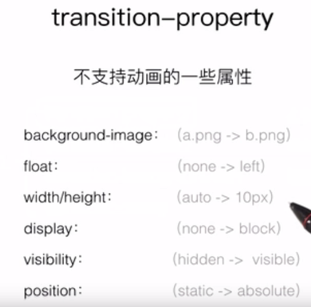

# CSS进阶
## 先写内容部分再写直播部分

### 内容部分
1.让人眼前一亮的动画  
简历上可添加动画，可让人眼前一亮  

2.transition补间动画  
只可以设置开始和结束两个状态，中间的状态由浏览器计算执行  
如果想要设置多个状态可以看下一节(3.animation)  

transition是复合属性：  
* transition-property 想要执行动画的属性(前后发生变化的属性 可以设为all)  
* transition-duration 动画持续时间  
* transition-timing-function 动效(重要)  
* transition-delay 延迟时间  

例

	<!DOCTYPE html>
	<html lang="en">
	<head>
    <meta charset="UTF-8">
    <title>动画</title>
    
	</head>
	<body>
    

        

    

	</body>
	</html>

不支持动画的属性：  
  
注意：图上width/height 是指不能由auto-固定值 但是固定值-固定值时支持动画  

3.animation帧动画  
可以设置初始和结束状态也可以通过关键帧设置执行中的状态  

语法：  

	@keyframes animation-name{  
		x%(动画执行了x%的时刻){
			此刻状态 比如:transform:translate(200px,200px);
		}
		...
	}

to表示最后一帧(100%)

animation也是复合属性  
* animation-name 自己定义的 看上面语法部分  
* animation-duration 执行一次的时间  
* animation-timing-function 动效  
* animation-delay 延迟时间  
* animation-iteration-count:n | infinite(默认); 动画执行此数 infinite为无限次执行  
* animation-direction:alternate | normal(默认)；定义是否应该轮流反向播放动画 如果设置alternate 就会反向执行 反向算第二次执行  
 
以上是基本属性 可以写在复合属性内 且可选非必选  

animation-play-state:running | paused;规定动画正在运行还是暂停  

例

	<!DOCTYPE html>
	<html lang="en">
	<head>
    <meta charset="UTF-8">
    <title>animation</title>
    
	</head>
	<body>
    

        

    

	</body>
	</html>

4.响应式简介  
响应式相关概念(技术):  
viewport视窗  
media queries 媒体查询  
内容布局  
图片大小  

### 直播
开展一个项目之前要 搭建项目目录  
先开发UI再开发逻辑  

快捷操作(vs)  
div.ui-index 同 `

`  

..表示上一级  

设置css时，前面加.ui-index(就是层级关系分明)相当于一个命名空间(概念上 易于维护)  
如.ui-index- .btn  表示 .ui-index下的.btn  

常见垂直居中方式：
position:absolute;  
top:%;  
margin-top:-你居中元素的一半;(这行代码low 不如下面的)  
transform:translateY(-50%);(就是响应式的了 替代上面那行)  

五种常见的垂直居中方式:见文末干货  

代码写得好 后期就好维护 推荐书：《编写高质量代码》(看2-3遍 多多益善)  

js高程(多看 很有用)  

html css多敲 多练习才是硬道理 老看书没用 看看W3C就可以了  

学会自己解决问题 学会搜索  

了解基础的数据结构和算法 不需要太深入

学习js jquery canvas  

css布局常用flexbox