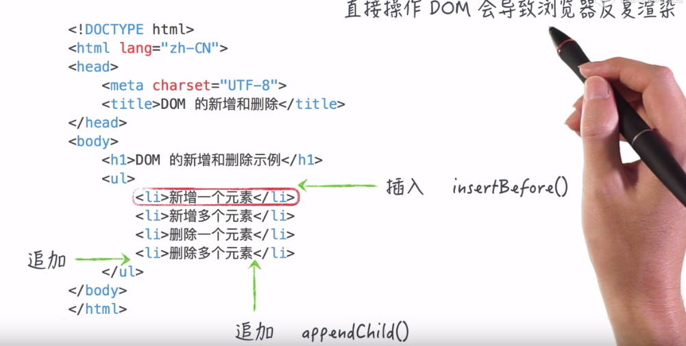

# JS继续学习 （DOM）
## 只有任务

1.DOM  
DOM：文档对象模型  
针对HTML文档的一个应用程序编程接口  

浏览器渲染过程：  
先将源码(HTML)转换成DOM树 然后在生成网页  
所以JS可以通过操纵DOM来增删改查HTML元素(对其进行操作)等  

2.DOM查找  
#### document.getElementById()
用法简单 不再介绍 只返回一个html元素
#### [document | Element].getElementsByClassName()
用法简单 不再介绍 返回一个类数组 不兼容IE8以下(兼容IE8)
#### [document | Element].getElementsByTagName()
用法简单 不再介绍 返回一个类数组
#### [document | Element].querySelector()  
querySelector() 方法返回文档中匹配指定 CSS 选择器的**一个**元素  
querySelector() 方法仅仅返回匹配指定选择器的第一个元素。如果你需要返回所有的元素，请使用 querySelectorAll() 方法替代  

例如：

获取文档中第一个 
 元素：`document.querySelector("p");`  
获取文档中 class="example" 的第一个元素:`document.querySelector(".example");`  
获取文档中 class="example" 的第一个 `
` 元素:`document.querySelector("p.example");`  
获取文档中有 "target" 属性的第一个 `<a>` 元素：`document.querySelector("a[target]");`  

获取文档中 id="example" 的第一个元素:`document.querySelector("#example");`  
就是用法同css选择器(即 函数的参数是css选择器)

#### [document | Element].querySelectorAll()
document.querySelectorAll() 是 HTML5中引入的新方法，返回文档中匹配的CSS选择器的**所有**元素节点列表(用法同querySelector())

3.DOM插入和删除  
#### 插入
insertBefore() 在某个元素前面插入
appendChild()  在父元素末尾追加

不要过多次操作DOM(比如循环添加)会导致浏览器反复渲染(刷新) 影响体验  

##### 那么如果要求增加多个元素怎么办?
DocumentFragment:文档片段，轻量级的节点  
DocumentFragment的一些常规属性 nodeType=11 nodeName=#document-fragment  
DocumentFragment游离在DOM树之外 所以可以作为仓库使用  
如果要新增多个节点 则可以把要新增的节点都放到仓库 添加好再一次性的放到DOM树中

#### 删除
查找要删除的节点 然后.removeChild()  
如果要删除多个节点呢：使用循环  

4.DOM新增  
document.createElement():创建元素节点  
document.createTextNode():创建文本节点  

例

	var h2=document.createElement("h2");
    var h2Text=document.createTextNode('OS 列表');
    h2.appendChild(h2Text);
    document.body.appendChild(h2);

    var ul=document.createElement("ul");
    document.body.appendChild(ul);

    var list=['Mac','Win','Linux'];
    for(var i=0;i<list.length;i++){
        var li=document.createElement("li");
        var liText=document.createTextNode(list[i]);
        li.appendChild(liText);
        ul.appendChild(li);
    }

6.修改样式  
#### 通过style属性修改样式
节点.style.样式=字符串
#### 通过class修改样式
1.方法一 节点.class=字符串;  
然后就是通过对字符串的各种修改了 包括直接修改 replace(字符串的各种方法、操作)  
2.方法二 节点的classList属性  
添加一个类名 节点.classList.add(字符串 多个值则用,隔开)   
删除一个类名 节点.classList.remove(字符串 多个值则用,隔开)  

获取节点类名的个数 节点.classList.length;  

[DOM document对象的各种属性和方法](http://www.runoob.com/jsref/dom-obj-document.html)  
[DOM classList属性](http://www.runoob.com/jsref/prop-element-classlist.html)

***

### 事件相关 (简单的就不写了)  
当今标准DOM事件流(事件模型) 见下图  
其中事件捕获因为浏览器兼容问题 基本没人用 另外两种常用  
捕获模型和冒泡模型(不用捕获模型 用冒泡模型)  

  

事件处理程序：事件(处理)回调函数  

#### 事件处理程序  
##### 添加事件
节点.addEventListener(事件,事件处理函数,false(表示使用冒泡模型));  
注意：添加事件只推荐这种方法  

##### 作用域
this指向绑定事件的元素  

##### 删除
节点.removeEventListener(事件,事件处理函数(同添加时的函数));

#### 事件对象  
##### 包含所有与事件相关的信息
事件对象:event
  
#####事件冒泡  
比如事件绑定到document 但是点击h1 会触发事件  

阻止事件冒泡:  
`event.stopPropagation(); 添加到事件处理函数中` 

例

html

    <ul>
        <li>一</li>
        <li>二</li>
        <li class="clickMe">三、点我</li>
        <li>四</li>
        <li>五</li>  
    </ul>

添加事件

	var clickMe=document.querySelector('.clickMe');
	clickMe.addEventListener('click',function(){
		console.log(this.innerHTML)
	},false);

删除事件

    var clickMe=document.querySelector('.clickMe');
    clickMe.removeEventListener('click',function(){
        console.log(this.innerHTML)
    });

事件冒泡

    document.body.addEventListener('click',function(event){
        console.log(event.target.innerHTML)
    },false);

阻止事件冒泡

    var clickMe=document.querySelector('.clickMe');
    document.body.addEventListener('click',function(event){
        console.log(event.target.innerHTML)
    },false);

    clickMe.addEventListener('click',function(){
        event.stopPropagation();
    },false);

效果:分别点击五个li 第三个li无输出值 其它的都有输出值  

干货  

[DOM document对象的各种属性和方法](http://www.runoob.com/jsref/dom-obj-document.html)  
[DOM classList属性](http://www.runoob.com/jsref/prop-element-classlist.html)  
[视频 常见的事件类型](https://ke.qq.com/webcourse/index.html#course_id=8493&term_id=100133314&taid=532288181903661&vid=j1400yqwbbb)  
[视频 JavaScript DOM全套](https://ke.qq.com/course/26269#tuin=b64d5a3e)  
[MDN DOM与事件](https://developer.mozilla.org/zh-CN/docs/Web/API/Document_Object_Model/Events)  
[W3C DOM与事件](http://www.w3school.com.cn/js/js_htmldom_events.asp)
