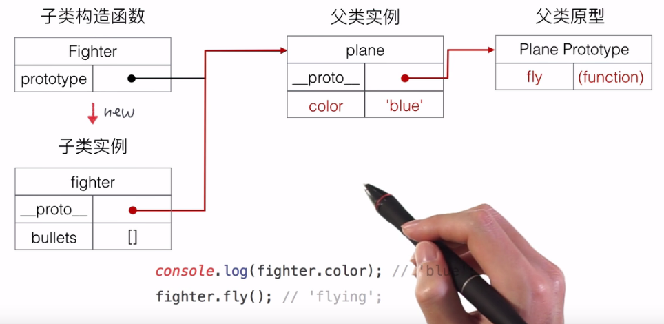

# JS再次学习
## 任务和直播都有

#### 任务
1.jquery  
jquery：js开源库  

2.jquery体系和文档  
有时间一定好好重温jquery(以前片面的学过 逃)

这些我都会...先不记啦(毕竟大三了) 大概讲了 对象与实例 构造函数 工厂函数 原型prototype 继承 原型链 canvas api 有时间我会重温的    

图挺好的 解释的是原型链  
  
打通原型链关键步骤：Fighter.prototype=new Plane('参数');

### canvas 
context.fillRect(x,y,宽,高);  
context.strokeRect(x,y,宽,高);

html

	<canvas id="canvas" width="500" height="500"></canvas>

js

    var canvas=document.querySelector('#canvas');
    canvas.style.backgroundColor='#ddd';
    var context=canvas.getContext('2d');
    context.fillRect(50,50,100,100);
    context.strokeRect(50,300,100,50);
 
context.drawImage(image对象,x,y,[宽],[高]);

js

    var canvas=document.querySelector('#canvas');
    canvas.style.backgroundColor='#ddd';
    var context=canvas.getContext('2d');
    var img=new Image();
    img.src='tx5.jpg';
    img.addEventListener('load',function(){  //img加载完再绘图
        context.drawImage(img,100,100,200,200);
    },false);

干货  
[w3cschool jquery教程](http://www.w3school.com.cn/jquery/)  
[MDN Canvas教程](https://developer.mozilla.org/zh-CN/docs/Web/API/Canvas_API/Tutorial)

