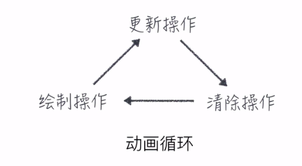

# 工具社区简介

***

1.练习 制作表情包  

html

	<canvas id="canvas" width="500" height="500"></canvas>

js

    var canvas = document.getElementById('canvas');
    var context = canvas.getContext('2d');

    var img=new Image();
    img.src='https://ke.qq.com/classroom/assets/lib/img/canvas-expression-base.png';
    img.addEventListener('load',function(){
        context.drawImage(img,50,110,200,200);
    },false);
        
    context.font='30px arial';
    context.fillText('今天的我',20,50);
    context.font='40px arial';
    context.fillText('还是一样的帅！',20,90);   

2.擦除canvas元素  
`context.clearRect(x,y,宽,高);`  
清除指定矩形区域的canvas  

`context.clearRect(0,0,context.width,context.height);`  
清除整个画布  

3.requestAnimationFrame  
requestAnimationFrame 是专门为实现高性能的帧动画而设计的一个API 可以把它用在 DOM 上的效果切换或者 Canvas 画布动画中  

兼容  
下面是我们常规使用 requestAnimationFrame 的兼容写法，当浏览器不兼容的 requestAnimationFrame 时则通过使用 setTimeout 来模拟实现,且设定渲染间隔为 1000ms/60。

	// 判断是否有 requestAnimationFrame 方法，如果有则模拟实现 不兼容的 requestAnimationFrame 时则通过使用 setTimeout 来模拟实现,且设定渲染间隔为 1000ms/60
	
	window.requestAnimFrame =
	window.requestAnimationFrame ||
	window.webkitRequestAnimationFrame ||
	window.mozRequestAnimationFrame ||
	window.oRequestAnimationFrame ||
	window.msRequestAnimationFrame ||
	function(callback) {
    	window.setTimeout(callback, 1000 / 30);
	}; 

例

	<!DOCTYPE html>
	<html>
	<head>
    <meta charset="UTF-8">
    <title>认识Canvas</title>
	</head>
	<body>
    <canvas id="canvas" width="500" height="500" style="border: 1px solid #33"></canvas>
    
	</body>
	</html>

4.动画循环  
  

例

        var canvas=document.getElementById("canvas");
        var context=canvas.getContext('2d');

        var monster={
            x:30,
            y:50,
            size:60,
            direction:'right'
        };
        var image=new Image();
        image.src='http://coding.imweb.io/img/p5/monster.png';
        image.onload=function(){
            context.drawImage(image,monster.x,monster.y,monster.y,monster.y);
            animate();
        };

        function animate(){
            context.clearRect(0, 0, canvas.width, canvas.height);
            if(monster.direction=='right'){
                if(monster.x<(canvas.width-monster.size)){
                    monster.x+=5;
                }else{
                    monster.direction='left';
                }
            }else{
                if(monster.x>monster.size){
                    monster.x-=5;
                }else{
                    monster.direction='right';
                }
            }
            context.drawImage(image,monster.x,monster.y,monster.y,monster.y);           
            requestAnimationFrame(animate);
        }

#### display:none;与opacity:0;的区别  
display:none；表示这个元素不在了 不占任何空间  
opacity:0;则表示透明度为0 相当于隐形 但是还是存在于原来的空间  

#### Object.assign()  
Object.assign() 方法用于将所有可枚举属性的值从一个或多个源对象复制到目标对象。它将返回目标对象  
语法：Object.assign(target, ...sources)

